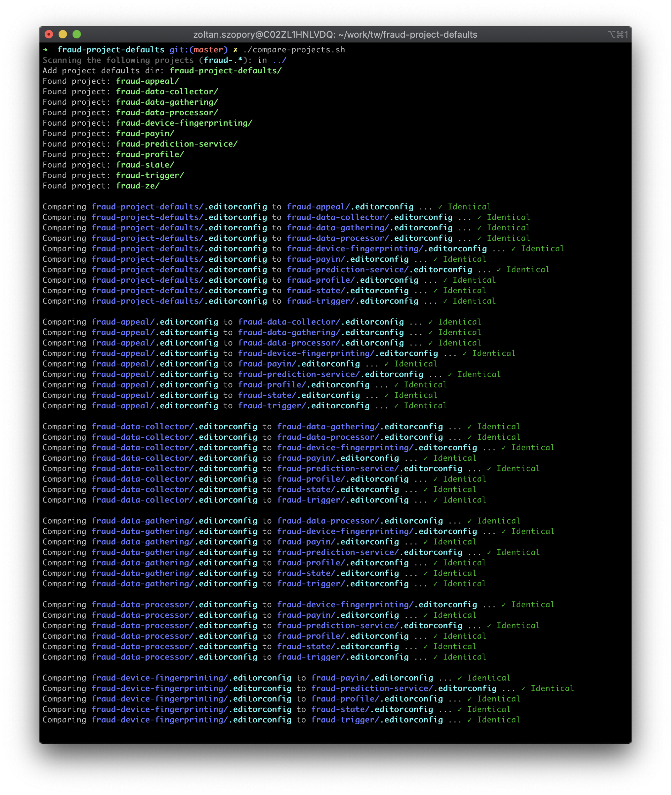

# fraud-project-defaults
Default editor config for fraud projects

## Summary
This repository contains the code style config files that should be common in every `fraud-*` projects.

Currently these are:
- `.editorconfig`
- `checkstyle.xml`

To quickly check that all your projects are using the same config, you can use `./compare-projects.sh` script.
Then you can manually update those files that differs.

_Sample output:_

## Useful links:
- [Fraud project setup in Confluence](https://transferwise.atlassian.net/wiki/spaces/FRAUD/pages/1278054795/Fraud+project+setup)